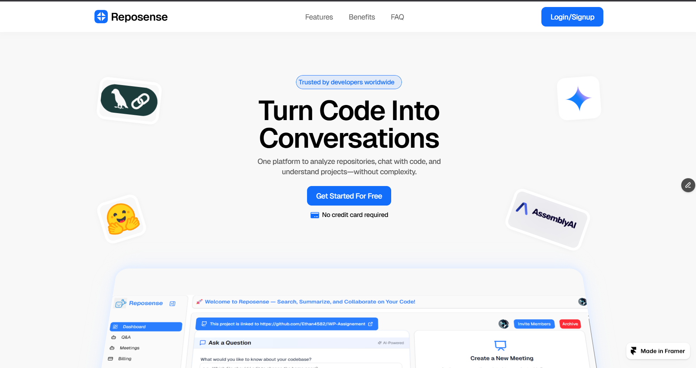
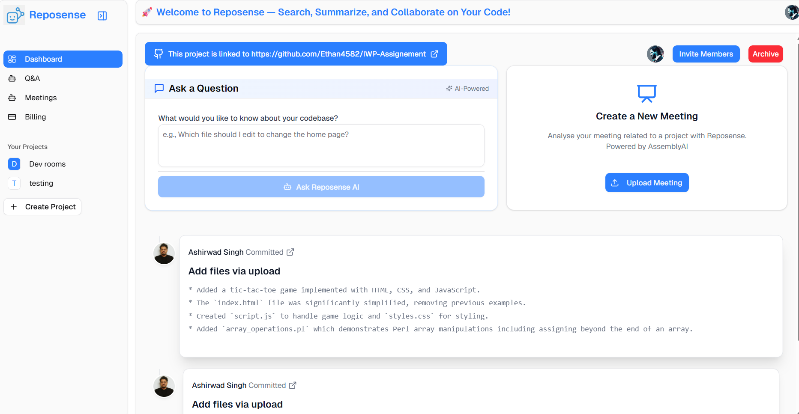

# RepoSense

**Chat with your GitHub repositories using AI-powered analysis and summarization**



<br/>

# Demo Video

[](https://www.youtube.com/watch?v=PQqPkdpA0V0)


RepoSense transforms GitHub repositories into intelligent, searchable knowledge bases. Upload your repository, and our AI will analyze, summarize, and create a conversational interface for your codebase.

## Key Features

### 🔍 **Repository Analysis**
- Automatic extraction and analysis of important files
- AI-powered file summarization using Gemini
- Commit history visualization with intelligent summaries

### 💬 **Intelligent Q&A**
- Chat with your repository using natural language
- Context-aware responses powered by RAG (Retrieval-Augmented Generation)
- Reference tracking showing which files informed each answer

### 📝 **Meeting Integration**
- Upload meeting recordings for automatic transcription
- AI-generated meeting summaries with key issues and timestamps
- Convert discussions into actionable insights

### 👥 **Collaboration**
- Invite team members to collaborate on projects
- Shared access to repository insights and Q&A history
- Saved questions and answers for team knowledge sharing

## Technology Stack

- **Frontend**: Next.js
- **AI/ML**: Gemini AI, LangChain, Hugging Face
- **Database**: PostgreSQL (Neon) with vector embeddings
- **Storage**: Cloudinary
- **Audio Processing**: Assembly.AI
- **Payment**: Stripe integration
- **ORM**: Prisma

## Getting Started

### Prerequisites
- Node.js 18+
- PostgreSQL database
- GitHub personal access token

### Installation

1. **Clone the repository**
   ```bash
   git clone https://github.com/yourusername/reposense.git
   cd reposense
   ```

2. **Install dependencies**
   ```bash
   npm install
   ```

3. **Set up environment variables**
   ```bash
   cp .env.example .env.local
   ```
   
   Configure the following variables:
   ```env
   DATABASE_URL=your_postgresql_connection_string
   GEMINI_API_KEY=your_gemini_api_key
   GITHUB_TOKEN=your_github_token
   CLOUDINARY_URL=your_cloudinary_url
   ASSEMBLY_AI_KEY=your_assembly_ai_key
   STRIPE_SECRET_KEY=your_stripe_secret_key
   ```

4. **Set up the database**
   ```bash
   npx prisma generate
   npx prisma db push
   ```

5. **Run the development server**
   ```bash
   npm run dev
   ```

## Usage

### Analyzing a Repository

1. **Add Repository**: Paste your GitHub repository URL
2. **Processing**: AI analyzes and summarizes important files
3. **Explore**: View commit summaries and file insights
4. **Chat**: Ask questions about your codebase

### Meeting Analysis

1. **Upload Audio**: Add meeting recordings (supported formats: MP3, WAV, MP4)
2. **Processing**: Automatic transcription and AI analysis
3. **Review**: Access timestamped summaries and key issues

## Pricing

- **Free Tier**: 150 credits included
- **Additional Credits**: $0.20 per 10 credits
- **Usage**: 1 credit per file summary

## API Rate Limits

⚠️ **Important**: This project uses Gemini's free tier API, which may hit rate limits for larger repositories. For production use, consider upgrading to a paid API plan.

## Contributing

1. Fork the repository
2. Create a feature branch (`git checkout -b feature/amazing-feature`)
3. Commit your changes (`git commit -m 'Add some amazing feature'`)
4. Push to the branch (`git push origin feature/amazing-feature`)
5. Open a Pull Request

## License

This project is licensed under the MIT License - see the [LICENSE](LICENSE) file for details.
